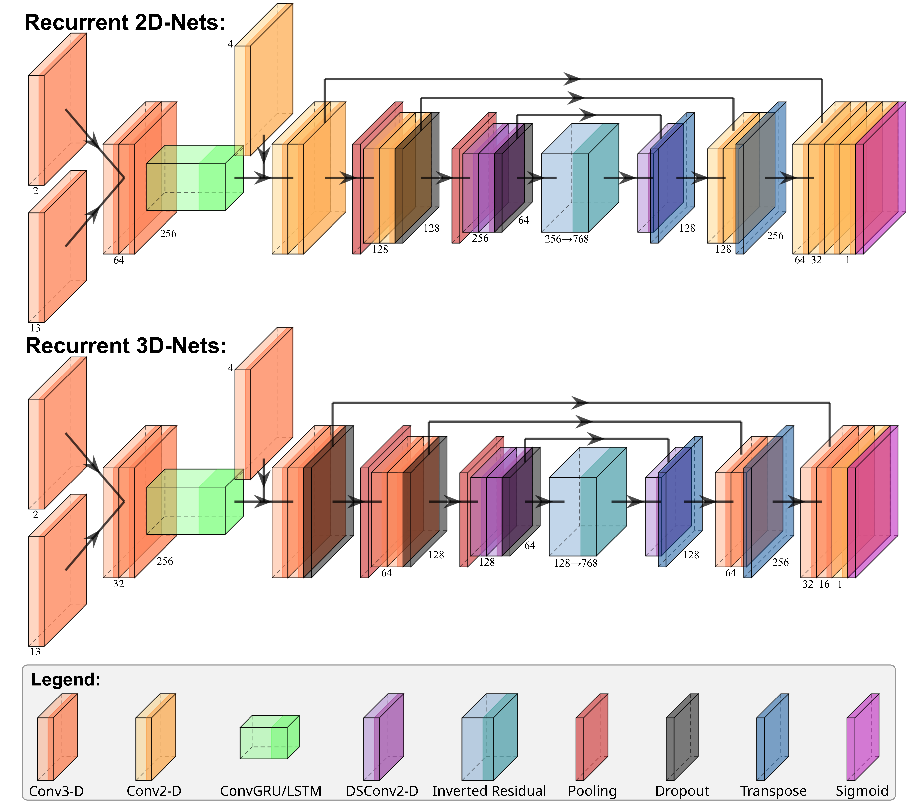

# RMC U-Nets

### Lightweight recurrent mixed-convolution U-Nets1 in PyTorch leveraging Convolutional Gated Recurrent Unit (GRU)2* and Long Short-Term Memory (LSTM)3* head for spatio-temporal feature forecasting and U-Net for spatial refinement.
#### Models use a mixture of 2-D and 3-D Convolutions, and 2-D Depthwise Separable Convolutions. DropBlock and Dropout3D are also included.
#### To use, create a derived class from the "RMC_2D/3D_Net" base class with "rtype" set to either "CGRU_cell" or "CLSTM_cell".

\[1\] [Ronneberger, O., Fischer, P., & Brox, T. (2015, October). U-net: Convolutional networks for biomedical image segmentation. In International Conference on Medical image computing and computer-assisted intervention (pp. 234-241). Cham: Springer international publishing.](https://link.springer.com/chapter/10.1007/978-3-319-24574-4_28)

\[2\] [Cho, K., Van Merriënboer, B., Bahdanau, D., & Bengio, Y. (2014). On the properties of neural machine translation: Encoder-decoder approaches. arXiv preprint arXiv:1409.1259.](https://arxiv.org/abs/1409.1259)

\[3\] [Hochreiter, S., & Schmidhuber, J. (1997). Long short-term memory. Neural computation, 9(8), 1735-1780.](https://ieeexplore.ieee.org/abstract/document/6795963)

* Recurrent mechanism implementations are taken from [jhhuang96](https://github.com/jhhuang96/ConvLSTM-PyTorch)
